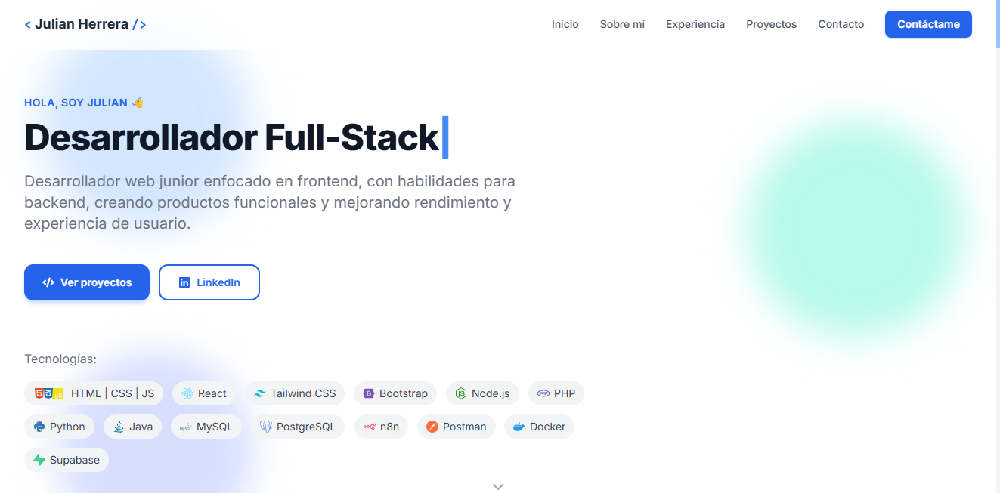

# Portafolio - Julian Herrera



## 📌 Sobre el Proyecto

Este es mi portafolio personal, diseñado y desarrollado para mostrar mi experiencia, habilidades y proyectos como **Desarrollador Full-Stack**. La interfaz está enfocada en brindar una experiencia de usuario limpia, moderna y responsiva.

**🌐 URL del proyecto:** [julianherrera-dev.vercel.app](https://julianherrera-dev.vercel.app)

## 🛠️ Tecnologías utilizadas

El proyecto fue construido utilizando tecnologías modernas del ecosistema frontend:

- **React** (Biblioteca principal)
- **TypeScript** (Tipado estático seguro)
- **Vite** (Entorno de desarrollo ultrarrápido)
- **Tailwind CSS** (Estilos y diseño responsivo)
- **Framer Motion** (Animaciones fluidas)
- **shadcn/ui** (Componentes de interfaz accesibles)

## 🚀 Instalación y Desarrollo Local

Si deseas ejecutar este proyecto localmente, sigue estos pasos:

1. **Clona el repositorio:**
   ```sh
   git clone <TU_URL_DE_GIT>
   ```

2. **Navega al directorio del proyecto:**
   ```sh
   cd <NOMBRE_DEL_PROYECTO>
   ```

3. **Instala las dependencias necesarias:**
   Asegúrate de tener Node.js instalado.
   ```sh
   npm install
   ```

4. **Inicia el servidor de desarrollo:**
   ```sh
   npm run dev
   ```

El servidor local se iniciará y podrás ver los cambios en tiempo real.

## 👨‍💻 Acerca de Mí

Soy desarrollador web junior enfocado en frontend, con habilidades para backend, creando productos funcionales y mejorando rendimiento y experiencia de usuario. Siempre buscando optimizar procesos y construir soluciones eficientes.

---
*Desarrollado por [Julian Herrera]*
